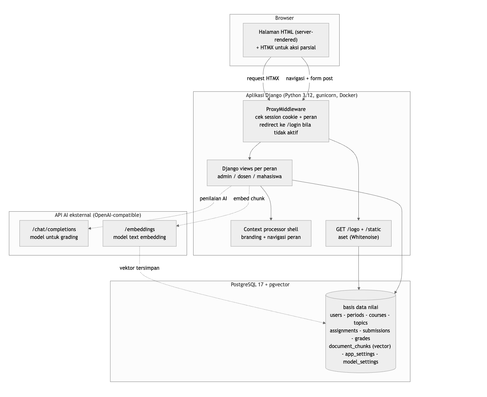
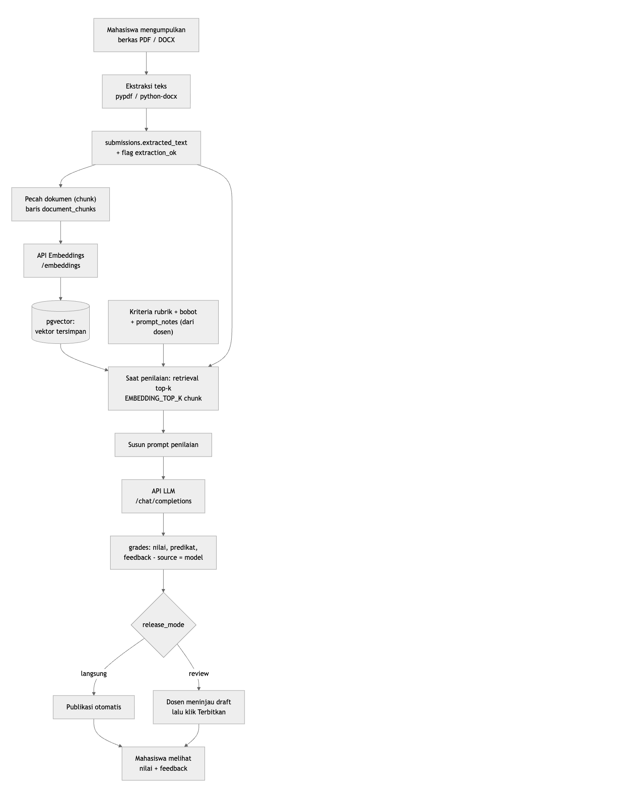
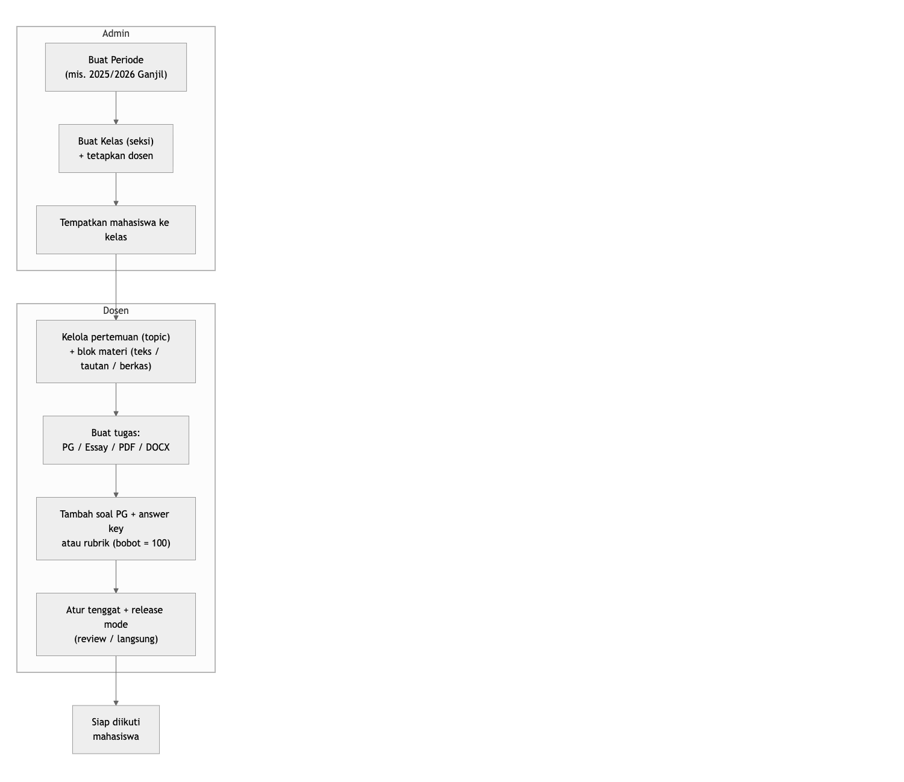
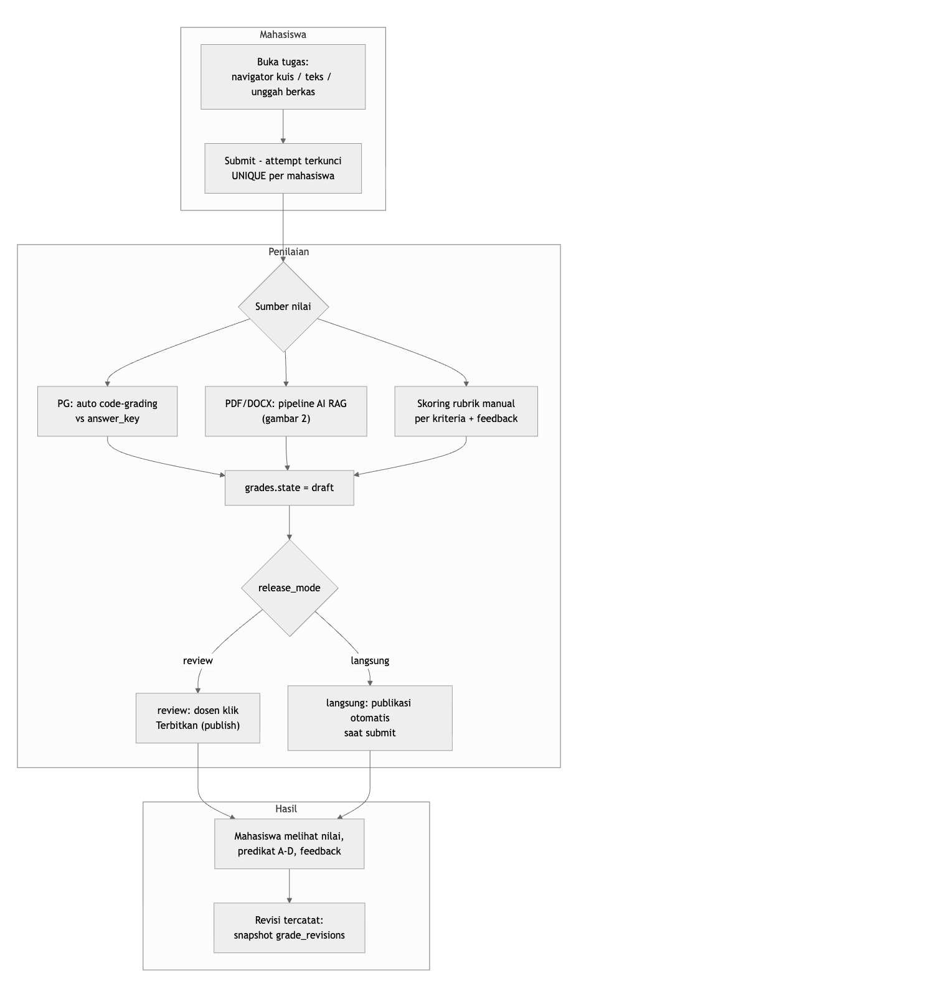
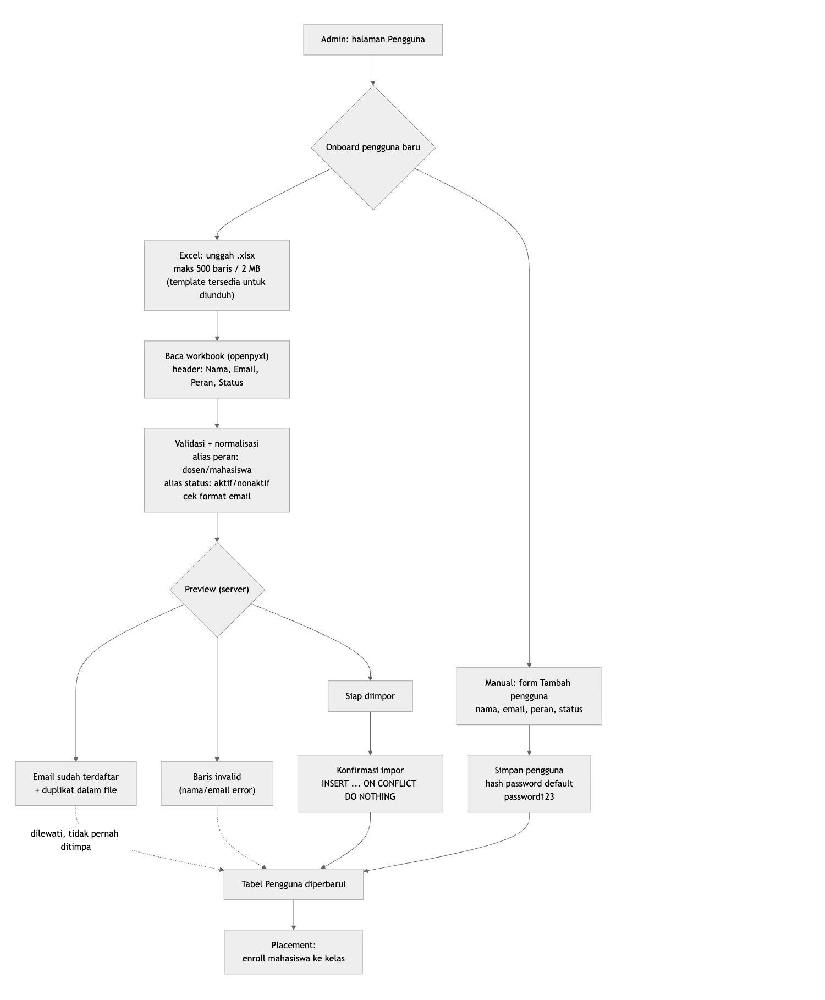

<!-- Sumber REPORT.pdf. Build dari root repositori:
     pandoc REPORT.md -s --toc --toc-depth=2 --metadata toc-title="DAFTAR ISI" \
       --metadata lang=id --css=docs/report-style.css --embed-resources \
       --resource-path=. -o /tmp/report.html
     "/Applications/Google Chrome.app/Contents/MacOS/Google Chrome" --headless \
       --no-pdf-header-footer --print-to-pdf=REPORT.pdf file:///tmp/report.html -->

---
title: Laporan Proyek — Nilai
subtitle: Platform Penilaian Akademik Berbantuan AI
author: "Laporan dibuat: Oktober 2026 · Repositori: umbima-smt1-tugas-generativeai"
---

## 1. Tentang proyek ini

Nilai adalah platform web untuk mengelola mata kuliah dan penilaian secara end-to-end: mata kuliah dan tugas, pengumpulan (submission) oleh mahasiswa, penilaian berbasis rubrik, serta penilaian berbantuan AI opsional (LLM + RAG atas potongan dokumen PDF/DOCX yang disimpan di pgvector). Terdapat tiga peran: **Admin**, **Dosen**, dan **Mahasiswa**. Nama tampilan, teks footer, dan logo dapat dikonfigurasi oleh admin pada tab Aplikasi (default: "MiniCourse").

### Stack teknologi saat ini

- **Bahasa & framework:** Python 3.12 + Django 5.2, halaman dirender di server (server-rendered templates) dengan HTMX (django-htmx) untuk aksi parsial.
- **Basis data:** PostgreSQL 17 + ekstensi pgvector (kolom vektor `document_chunks.embedding`).
- **Runtime & deployment:** Gunicorn (WSGI) + WhiteNoise untuk aset statis, dikemas dengan Docker / Docker Compose.
- **Pustaka pendukung:** openpyxl (impor Excel), pypdf dan python-docx (ekstraksi dokumen), psycopg (driver PostgreSQL), httpx / urllib (panggilan API AI), python-dotenv (konfigurasi).
- **Autentikasi:** model pengguna kustom berbasis email, sesi signed-cookie, dan hasher scrypt yang kompatibel dengan hash lama (format Node).

**Status: port selesai.** Proyek ini merupakan port penuh dari aplikasi Next.js awal; setelah paritas terverifikasi, kode TypeScript/Next.js lama dihapus dari repositori. Yang dipertahankan persis seperti versi lama: skema basis data (byte-parity, termasuk constraint dan format hash password), seluruh URL tanpa trailing slash, teks UI dalam bahasa Indonesia, serta perilaku aplikasi. Paritas diverifikasi oleh rangkaian uji HTTP/e2e (bagian 2) dengan baseline **1422 pemeriksaan, 0 kegagalan**.

## 2. Bagaimana proyek ini dibuat

Proyek ini dibangun secara iteratif dengan mem-prompt agen coding AI dari command line, dengan manusia yang mengarahkan, mereview, dan men-commit setiap tahap. Proyek tidak dihasilkan dari satu prompt saja — ia tumbuh melalui siklus berulang:

1. **Prompt** — manusia menjelaskan sebuah fitur atau perubahan dalam bahasa natural.
2. **Implementasi** — agen menjelajahi codebase, mengedit file, dan konsisten mengikuti design system yang ada (UI bergaya Moodle Boost, teks UI dalam bahasa Indonesia).
3. **Pemeriksaan statis** — untuk Python: `python manage.py check` dan migrasi Django; pada tahap awal (Next.js): `tsc --noEmit` dan `eslint --max-warnings=0`.
4. **Verifikasi otomatis** — protokol pengujian terhadap environment yang berjalan nyata: rangkaian aksi berbasis HTTP dengan asersi SQL, spot-check halaman untuk setiap peran, uji login/sesi, suite Django test-client (`tests/test_*.py`), serta walkthrough end-to-end dengan Playwright di browser sungguhan (termasuk alur branding dan impor Excel).
5. **Restore** — database direset ke state seed yang bersih setiap kali full test run selesai.
6. **Commit** — hanya atas permintaan eksplisit manusia; setiap tahap fitur menjadi satu commit.

### Tahap pengembangan (berdasarkan git history & working tree)

| Tahap | Isi yang dibangun | Commit |
|---|---|---|
| 1 | App inti: peran & auth, mata kuliah, topic, 4 tipe tugas (PG/essay/PDF/DOCX), submissions, penilaian rubrik, pipeline penilaian AI (extract → embed → RAG → LLM), area admin/dosen/mahasiswa, seed data — plus struktur akademik: **Periode**, **Kelas (seksi)**, dan penempatan mahasiswa | `8ddebcc` |
| 2 | **Branding** yang dapat dikonfigurasi admin (tab "Aplikasi") dan **impor Excel pengguna** (preview → konfirmasi, email yang sudah ada dilewati, unduh template) | `67fb991` |
| 3 | `README.md` berisi fitur, quickstart, konfigurasi, dan panduan deploy | `8df6d2c` |
| 4 | Laporan proyek (dokumen ini) dalam format PDF | `ab168c1` |
| 5 | Diagram alur proyek + pembaruan laporan PDF | `a516d71` |
| 6 | Terjemahan laporan proyek dan diagram alur ke Bahasa Indonesia | `2e79fdd` |
| 7 | **Port penuh ke Python/Django**: model ORM + migrasi byte-parity untuk seluruh skema, autentikasi kustom (hasher scrypt kompatibel), seluruh halaman admin/dosen/mahasiswa dengan HTMX, pipeline penilaian AI, perintah `manage.py seed`, rangkaian uji (Django test-client + live-server + Playwright), dan penghapusan kode TypeScript/Next.js | working tree |

## 3. Bagaimana proyek ini bekerja — arsitektur & alur data

Gambar 1 menunjukkan arsitektur sistem. Browser memuat halaman HTML yang dirender Django (HTML + HTMX untuk aksi parsial). ProxyMiddleware memeriksa cookie sesi dan peran pada setiap request: pengguna yang tidak aktif diarahkan ke `/login`, dan akses ke prefix peran yang salah dibelokkan ke beranda perannya. Seluruh data disimpan di satu basis data PostgreSQL (dengan pgvector untuk embedding). Panggilan AI menuju API eksternal yang compatible dengan OpenAI dan dikonfigurasi di `/admin/settings`.

Gambar 2 menunjukkan pipeline penilaian AI. Dokumen yang diunggah di-ekstrak menjadi teks (berkas mentah tidak disimpan), lalu dipecah (chunk) dan di-embed ke pgvector. Saat penilaian, top-k chunk (jumlah `EMBEDDING_TOP_K`, default 6) bersama rubrik dari dosen dikirim ke LLM, yang mengembalikan nilai, predikat, dan feedback dan dicatat sebagai grade draf (`source = model`) sampai dipublikasikan.

### Rincian pipeline penilaian

- **Ekstraksi** — PDF via pypdf, DOCX via python-docx; hasilnya disimpan di `submissions.extracted_text` dengan flag `extraction_ok`.
- **Chunking & embedding** — teks dipecah menjadi baris `document_chunks`, lalu di-embed lewat endpoint `/embeddings` dan disimpan sebagai vektor berdimensi `EMBEDDING_DIM` (default 1536).
- **Retrieval** — potongan paling relevan diambil dengan operator jarak vektor (`<=>`) sebanyak top-k.
- **Prompt** — preamble sistem (`model_settings.system_preamble`) + aturan penilaian + kriteria rubrik (bobot, deskripsi level, dan `prompt_notes` dari dosen) + jawaban mahasiswa; model diminta membalas JSON yang ketat.
- **Hasil** — nilai dan predikat (A–D) dihitung di server, feedback disimpan pada baris `grades`; setiap penyimpanan membuat snapshot di `grade_revisions`. Sumber nilai: `model`, `manual`, `code` (PG otomatis), atau empty.

## 4. Alur kerja & proses bisnis

**Penyiapan mata kuliah (Admin → Dosen).** Admin membuat periode akademik, membuat kelas (seksi), menetapkan dosen pengampu, dan menempatkan mahasiswa. Dosen selanjutnya mengelola pertemuan (topic) beserta blok materi (teks / tautan / berkas), menyusun tugas (tipe PG/Essay/PDF/DOCX), menambahkan soal PG dengan answer key atau rubrik berbobot (total bobot = 100), lalu menentukan tenggat dan release mode. Tugas kemudian siap diikuti mahasiswa.

**Attempt, penilaian, dan rilis (Mahasiswa → grading → hasil).** Mahasiswa mengerjakan tugas sekali (unique per mahasiswa; attempt terkunci setelah submit). Grade dihasilkan oleh salah satu dari tiga sumber: jawaban PG di-code-grade terhadap answer key, dokumen PDF/DOCX melewati pipeline AI RAG (Gambar 2), dan penilaian manual menyekor tiap kriteria rubrik beserta feedback. Grade pertama kali berstatus **draft**; tergantung release mode, mode *langsung* mempublikasikan secara otomatis sedangkan *review* menunggu dosen mengklik Terbitkan. Mahasiswa kemudian melihat nilai, predikat (A–D), dan feedback; setiap perubahan selanjutnya di-snapshot dalam `grade_revisions`.

**Onboarding pengguna (Admin).** Pengguna baru ditambahkan secara manual atau massal lewat Excel: admin mengunggah berkas `.xlsx`, server mem-parse dan memvalidasinya dengan openpyxl (alias peran/status, format email), menampilkan pratinjau per baris (siap diimpor / sudah terdaftar / gagal), dan saat dikonfirmasi hanya menyisipkan baris baru yang valid — email yang sudah ada dilewati, tidak pernah ditimpa. Akun hasil impor memakai password default, lalu ditempatkan ke kelas melalui placement.

## 5. Ringkasan prompt / percakapan

Ringkasan parafrase dari prompt yang menggerakkan proyek (wording dipadatkan; sesi awal direkonstruksi dari catatan sesi). Kredensial/API key tidak disertakan.

1. **Build awal** — "Buat aplikasi penilaian akademik: peran admin, dosen, mahasiswa; mata kuliah dengan topic; tugas (PG, essay, PDF, DOCX) beserta submissions, rubrik, dan grades; penilaian berbantuan AI memakai LLM + embeddings/RAG; UI bergaya Moodle Boost dengan copy bahasa Indonesia; seed data untuk demo." *(Tahap awal juga menetapkan aturan proses: jawaban dalam bahasa Inggris, teks UI dalam bahasa Indonesia, tanpa emoji, jangan commit kecuali diminta, selalu verifikasi sebelum dianggap selesai.)*
2. **Struktur akademik** — "Tambahkan pengelolaan admin untuk periode akademik (Periode) dan kelas dengan seksi (Kelas), izinkan admin menempatkan mahasiswa ke kelas, tampilkan periode/kelas hanya-baca kepada dosen dan di semua kartu mata kuliah."
3. **Rebrand** — "Ganti brand menjadi MiniCourse."
4. **Branding konfigurabel** — "Izinkan admin mengonfigurasi nama aplikasi, teks footer, dan logo lewat tab admin baru 'Aplikasi'."
5. **Impor Excel** — "Impor pengguna dari Excel: admin mengunggah .xlsx, melihat preview dulu, lalu konfirmasi; lewati email yang sudah ada alih-alih menimpa; sediakan unduhan template."
6. **Verifikasi & delivery** — "commit, dan di mana kita bisa deploy ini?", "regenerate README dengan ringkasan proyek + cara deploy", lalu permintaan laporan ini beserta diagramnya.
7. **Port ke Python** — "Port aplikasi ini ke Python/Django dengan stack saat ini: model ORM untuk seluruh skema, autentikasi kustom, halaman admin (accounts & academics) dengan HTMX, perintah seed, dan panggilan model OpenAI-compatible — pertahankan skema basis data dan hash password yang kompatibel." *(Port kemudian dilanjutkan hingga paritas penuh: seluruh modul, rangkaian uji e2e, dan penghapusan kode TypeScript lama.)*
8. **Pembaruan laporan** — "Perbarui REPORT.pdf agar sesuai codebase saat ini yang memakai Python dan stack terbaru, beserta diagram alurnya."

## 6. Kredensial default

Akun demo (di-seed saat first boot lewat `python manage.py seed`, untuk keperluan development/demo — ganti atau nonaktifkan di production). Password seluruh akun: `password123`.

| Peran | Nama | Email | Password |
|---|---|---|---|
| Admin | Nur Audyah Ramadhani | audyah@nilai.test | password123 |
| Dosen | Ramadan Agung Wibawa | ramadan@nilai.test | password123 |
| Mahasiswa | Aldy | aldy@nilai.test | password123 |
| Mahasiswa | Mir'atil Hayati | miratil@nilai.test | password123 |
| Mahasiswa | Ismail Saputra | ismail@nilai.test | password123 |
| Mahasiswa | Fitri Lestari | fitri@nilai.test | password123 |

Selain akun, seed membuat data demo: 2 periode, 3 kelas, 8 enrollment, 5 topic, 4 tugas (essay, PG, PDF, DOCX) beserta soal dan rubrik, 4 submission, dan 2 grade.

**Basis data (default Docker Compose):** user `nilai`, password `nilai`, database `nilai`, host port `5432`.

**Port aplikasi:** `3000` (mode dev: `3001`).

**Rahasia tidak disertakan dalam laporan ini:** secret cookie sesi (`SESSION_SECRET`) dan API key LLM/embedding. Semuanya berada di `.env.local` (lihat `.env.example` untuk nama variabelnya) dan/atau `/admin/settings` — keduanya harus diisi operator, dan jangan pernah memakai nilai development di production.
